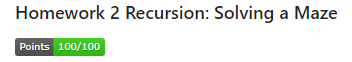
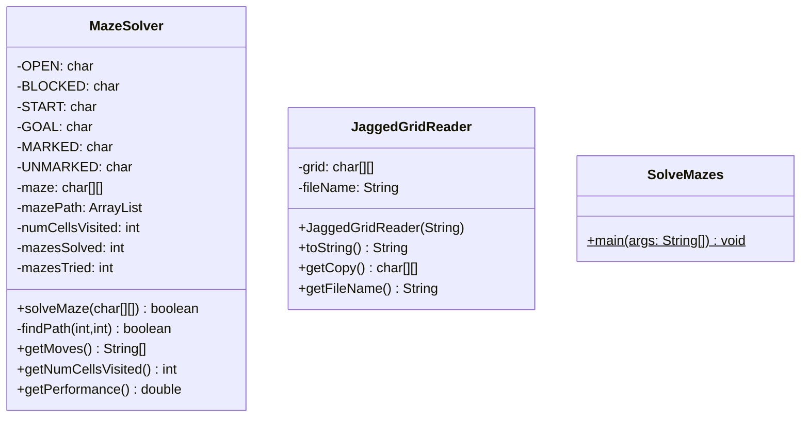
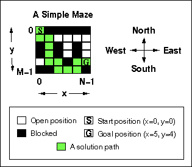

### DISCLAIMER: Autograding Result is not correctly shown. This repository was cloned to my public GitHub after successfully completing it as part of a University CS course. Credit for the creation of the assignment is https://github.com/WCU-CS-CooperLab
| Image of Score from Original Repository |
|-----------------------------------------|
||


[](https://classroom.github.com/online_ide?assignment_repo_id=10113476&assignment_repo_type=AssignmentRepo)
# CSC 240 Computer Science III
### Homework 2  Recursion: Solving a Maze

[](../../actions)

## Requirements

For this assignment, you'll be developing one java classes and one java program that will use the classes. You will also use the JaggedGridReader that you made from Homework 1. You'll need to put the JaggedGridReader.java file into the [hw1/ directory](hw1/JaggedGridReader.java) You may (and should) develop and submit your own testing classes in addition to the 2 required classes.

The classes that you will create are:

1. [`MazeSolver`](hw2/MazeSolver.java) - an object that solves a maze as a `char[][]` by writing the path onto the array and stores the path as an `ArrayList<String>`. After creating a `MazeSolver`, calling `solveMaze()` will update the maze and return `true` if a path was found, and `false` otherwise. If a the maze is solved, then `mazesSolved` will be incremented, and the `mazePath` will have the list of moves to take to solve the maze otherwise the `mazePath` will be cleared. In either case (solved or not), the `numCellsVisited` will be updated and the `mazesTried` will be incremented. After `solveMaze` is called, the other public methods can be called. `getMoves()` should return `null` if `solveMaze` hasn't been called or if the last time `solveMaze` was called it returned false. The UML diagram is below.
2. [`SolveMazes`](hw2/SolveMazes.java) - This is the program. `SolveMazes` should repeatedly ask for a file name or the word `stop`. Each time the file name is not `stop`, it should use the `JaggedGridReader` from homework 1 to read the file, use the `MazeSolver` to solve the maze, then print the solution to the maze along with the number of cells visited, or "No Solution" if the maze was not solved. Once it finishes processing the mazes, it should print the performance of the maze solver as a percentage with no decimal places and then the program should end. For example:
   - `Percent Correct: 100%` 





### Class description
[`MazeSolver`](hw2/MazeSolver.java) - an object for reading files into a 2-D array. 
- fields
  - 6 final char fields to define the characters representing the maze.
  - maze: the two dimensional `char` array that holds the current maze.
  - mazePath: the solution to the maze after solving the maze or null if the maze is unsolved.
  - numCellsVisited: the number of cells visited for the current maze solved.
  - mazesSolved: the number of mazesSolved
  - mazesTried: the number of mazesTried
- methods
  - [`solveMaze(...)`](#solve-maze): takes a maze, calls findPath, updates mazesTried, updates mazesSolved depending on whether a path was found.
  - [`findPath()`](#find-path): this method recursively searches for a path. If a move leads to the goal, then it should be added to `mazePath`. If a cell is open and searched (marked), then the `numCellsVisited` should increase.
  - `getMoves()`: this method should return the mazePath as an array or `null` if the maze was not solved. 
  - `getNumCellsVisited()`: returns the number of cells visited the last time solveMaze was called.
  - `getPerformance()`: this method should return ratio of mazesSolved/mazesTried. 


[Below](#the-problem) is an article describing the problem space and algorithm to solve a maze on a character grid. Use this for the `MazeSolver` class.

### Submission

When you submit your 2 class files to the [hw2 directory](hw2) of this repository they will be tested with the GitHub classroom autograding system. You can submit as many versions of each file until all of the tests pass.

The first set of tests will test the `MazeSolver`. Then the `SolveMazes` program will be tested. All of the test programs are in the [test](test/) directory and the sample mazes are in the [maze](maze/) directory. Some mazes have no solution.


### Resources

Recursion is covered in a number of places:

1. Course slides: Program Control Part 2 near the end
2. Gaddis Chapter 15, slides and book code is available on D2L
3. Runestone book, Java,Java,Java Ch 12.


## Recursion: Solving a Maze
(from:
[https://web.archive.org/web/20200226004300/https://www.cs.bu.edu/teaching/alg/maze/](https://web.archive.org/web/20200226004300/https://www.cs.bu.edu/teaching/alg/maze/))


### The Problem

A robot is asked to navigate a maze. It is placed at a certain position
(the *starting* position) in the maze and is asked to try to reach
another position (the *goal* position). Positions in the maze will
either be open or blocked with an obstacle. Positions are identified by
(x,y) coordinates.



At any given moment, the robot can only move 1 step in one of 4
directions. Valid moves are:

- Go North: (x,y) -\> (x,y-1)
- Go East: (x,y) -\> (x+1,y)
- Go South: (x,y) -\> (x,y+1)
- Go West: (x,y) -\> (x-1,y)

Note that positions are specified in zero-based coordinates (i.e.,
0...size-1, where *size* is the size of the maze in the corresponding
dimension).

The robot can only move to positions without obstacles and must stay
within the maze.

The robot should search for a path from the starting position to the
goal position (a *solution path*) until it finds one or until it
exhausts all possibilities. In addition, it should mark the path it
finds (if any) in the maze.

**Representation**

To make this problem more concrete, let\'s consider a maze represented
by a matrix of characters. An example 6x6 input maze is:


| Maze | |Description|
|----|----|----|
|<pre>S#####<br>.....#<br>#.####<br>#.####<br>...#.G<br>##...#</pre>|		|'.' - where the robot can move (open positions)<br>'#' - obstacles (blocked positions)<br>'S' - start position (here, x=0, y=0)<br>'G' - goal (here, x=5, y=4)<br>|

**Aside:** Remember that we are using *x* and *y* coordinates (that
start at 0) for maze positions. A *y* coordinate therefore corresponds
to a row in the matrix and an *x* coordinate corresponds to a column.

A path in the maze can be marked by the \'+\' symbol\...

| description | maze | description | maze | description  |
|----|----|----|----|----|
| A *path* refers to either a *partial* path, marked while the robot is still searching:	|<pre>+#####<br>++++.#<br>#.####<br>#.####<br>...#.G<br>##...#</pre>|	(i.e., one that may or may not lead to a solution). Or, a *solution* path:	|<pre>S#####<br>++...#<br>#+####<br>#+####<br>.++#+G<br>##+++#</pre>|	which leads from start to goal.|


**Algorithm**

We'll solve the problem of finding and marking a solution path using
*recursion*.

Remember that a recursive algorithm has at least 2 parts:

*• Base case(s)* that determine when to stop.

*• Recursive part(s)* that call the same algorithm (i.e., itself) to
assist in solving the problem.

#### Recursive parts

Because our algorithm must be *recursive*, we need to view the problem
in terms of similar *subproblems*. In this case, that means we need to
"find a path" in terms of "finding paths."

Let's start by assuming there is already some algorithm that finds a
path from some point in a maze to the goal, call it `FIND-PATH(x, y)`.

Also suppose that we got from the start to position x=1, y=2 in the maze
(by some method):

| Maze  |Description|
|----|----|
|<pre>+#####<br>++...#<br>#[+](#recursive-parts)####<br>#.####<br>...#.G<br>##...#</pre>|	What we now want to know is whether there is a path from **x=1, y=2** to the goal. If there is a path to the goal from x=1, y=2, then there is a path from the *start* to the goal (since we already got to x=1, y=2). |


To find a path from position x=1, y=2 to the goal, we can just ask
`FIND-PATH` to try to find a path from the North, East, South, and West of
x=1, y=2:

- `FIND-PATH(x=1, y=1)` *North*
- `FIND-PATH(x=2, y=2)` *East*
- `FIND-PATH(x=1, y=3)` *South*
- `FIND-PATH(x=0, y=2)` *West*

Generalizing this, we can call `FIND-PATH` recursively to move from any
location in the maze to adjacent locations. In this way, we move through
the maze.

**Base cases**

It's not enough to know how to use `FIND-PATH` recursively to advance
through the maze. We also need to determine when `FIND-PATH` must stop.

One such *base case* is to stop when it *reaches the goal*.

The other base cases have to do with moving to invalid positions. For
example, we have mentioned how to search North of the current position,
but disregarded whether that North position is legal. In order words, we
must ask:

- *Is the position in the maze* (...or did we just go outside its
bounds)?
- *Is the position open* (...or is it blocked with an obstacle)?

Now, to our base cases and recursive parts, we must add some steps to
mark positions we are trying, and to unmark positions that we tried, but
from which we failed to reach the goal:

#### find path
**`FIND-PATH(x, y)`**

```
1 if (x,y outside maze) return false
2 if (x,y is goal) return true
3 if (x,y not open) return false
4 mark x,y as part of solution path
5 if (FIND-PATH(North of x,y) == true) return true
6 if (FIND-PATH(East of x,y) == true) return true
7 if (FIND-PATH(South of x,y) == true) return true
8 if (FIND-PATH(West of x,y) == true) return true
9 unmark x,y as part of solution path
10 return false
```
All these steps together complete a basic algorithm that finds and marks
a path to the goal (if any exists) and tells us whether a path was found
or not (i.e., returns true or false). This is just one such
algorithm\--other variations are possible.

**Note:** `FIND-PATH` will be called at least once for each position in
the maze that is tried as part of a path.

Also, after going to another position (e.g., North):

`if (FIND-PATH(North of x,y)¹ == true) return true²`

if a path to the goal was found, it is important that the algorithm
stops. I.e., if going North of x,y finds a path (i.e., returns
**true**¹), then from the current position (i.e., current call of
`FIND-PATH`) there is no need to check East, South or West. Instead,
`FIND-PATH` just need **return true**² to the previous call.

Path marking will be done with the `'+'` symbol and unmarking with the
`'x'` symbol.

#### solve maze

**Using Algorithm**

To use `FIND-PATH` to find and mark a path from the start to the goal with
our given representation of mazes, we just need to:

1. Locate the start position (call it *startx*, *starty*).
2. Call `FIND-PATH(startx, starty)`.
3. Re-mark* the start position with 'S'.

*In the algorithm, the start position (marked \'S\') needs to be
considered an *open* position and must be *marked* as part of the path
for `FIND-PATH` to work correctly. That is why we re-mark it at the end.

#### Backtracking

An important capability that the recursive parts of the algorithm will
give us is the ability to *backtrack*.

| Maze  |Description|
|----|----|
|<pre>++####<br>#+#..#<br>#+#..#<br>#+[**+**](#mark)#.#<br>###...<br>G...##</pre>|	For example, suppose the algorithm just [*marked*](#mark) position x=2, y=3 in this maze. I.e, it is in the call to `FIND-PATH(x=2, y=3)`. After marking...|
|<pre>++####<br>#+#..#<br>#+[#](#mark)..#<br>#++#.#<br>###...<br>G...##</pre>|	First, it will try to find a path to the goal from the position [*North*](#mark) of x=2, y=3, calling `FIND-PATH(x=2, y=2)`.<br>Since the North position is not open, the call `FIND-PATH(x=2, y=2)` will return false, and then it will go back (*backtrack*) to `FIND-PATH(x=2, y=3)` and resume at the step just after it went North.|
|<pre>++####<br>#+#..#<br>#+#..#<br>#++[#](#mark).#<br>###...<br>G...##</pre>|	Next, it will go [*East*](#mark) of x=2, y=3, calling `FIND-PATH(x=3, y=3)`.<br>This position is not open, so it will *backtrack* to `FIND-PATH(x=2, y=3)` and resume at the step just after it went East.|
|<pre>++####<br>#+#..#<br>#+#..#<br>#++#.#<br>##[#](#mark)...<br>G...##</pre>|	Next, it will go [*South*](#mark) of x=2, y=3, calling call `FIND-PATH(x=2, y=4)`.<br>This position is not open, so it will *backtrack* to `FIND-PATH(x=2, y=3)` and resume at the step just after it went South.|
|<pre>++####<br>#+#..#<br>#+#..#<br>#[+](#mark)x#.#<br>###...<br>G...##</pre>|	Finally, it will go [*West*](#mark) of x=2, y=3, calling `FIND-PATH(x=1, y=3)`.<br>This position is not open, so it will *backtrack* to `FIND-PATH(x=2, y=3)` and resume at the step just after it went West.<br>Since West is the last direction to search from x=2, y=3, it will unmark x=2, y=3, and *backtrack* to the previous call, `FIND-PATH(x=1, y=3)`.|


**Questions**

In order to demonstrate an understanding of this problem and solution,
you should be able to answer the following questions:

1. What happens if instead of searching in the order *North, East, South,
West*, `FIND-PATH` searches *North, South, East, West*?
2. In all cases when `FIND-PATH` returns *false*, does that mean there is
no path from the start to the goal?
3. Can parts of the maze be searched by `FIND-PATH` more than once? If so,
how can this be rectified? If not, how does the algorithm prevent that?
4. What can you say about the kinds of paths that `FIND-PATH` finds?

***BU CAS CS - Recursion:** Solving a Maze*

*Copyright © 1993-2000 by Robert I. Pitts \<rip at bu dot edu>. All
Rights Reserved.*
